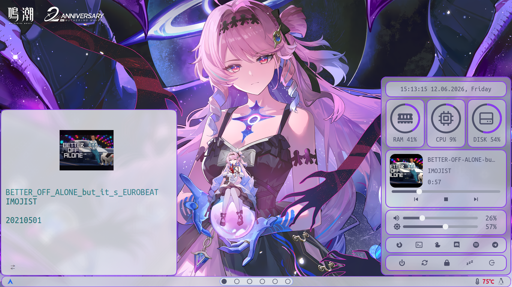

## DEPENDENCIES
- [eww](https://github.com/elkowar/eww)
- [playerctl](https://github.com/altdesktop/playerctl)
- [brightnessctl](https://github.com/Hummer12007/brightnessctl) 
- [jq](https://github.com/jqlang/jq)
- [grim-hyprland](https://github.com/eriedaberrie/grim-hyprland)
- [curl](https://github.com/curl/curl)

## INSTALLATION
1. Clone the repository:
```bash
git clone git@github.com:Asep5K/my-eww-bar-gw.git
cd my-eww-bar-gw
```
2. Copy configuration:
```bash
mkdir -p ~/.config
cp -r .config/eww ~/.config
```

## SETUP
To sync your workspace with the bar, add this to your `~/.config/hypr/hyprland.lua`
```lua
hl.on("workspace.active", function()
	local active_ws = hl.get_active_workspace()
	if active_ws then
		hl.exec_cmd("eww update active_workspace=" .. active_ws.id)
	end
end)
```

## RUN
```bash
eww open-many bar_widget workspace_hover
```

## KISS (Keep It Simple, Stupid)
